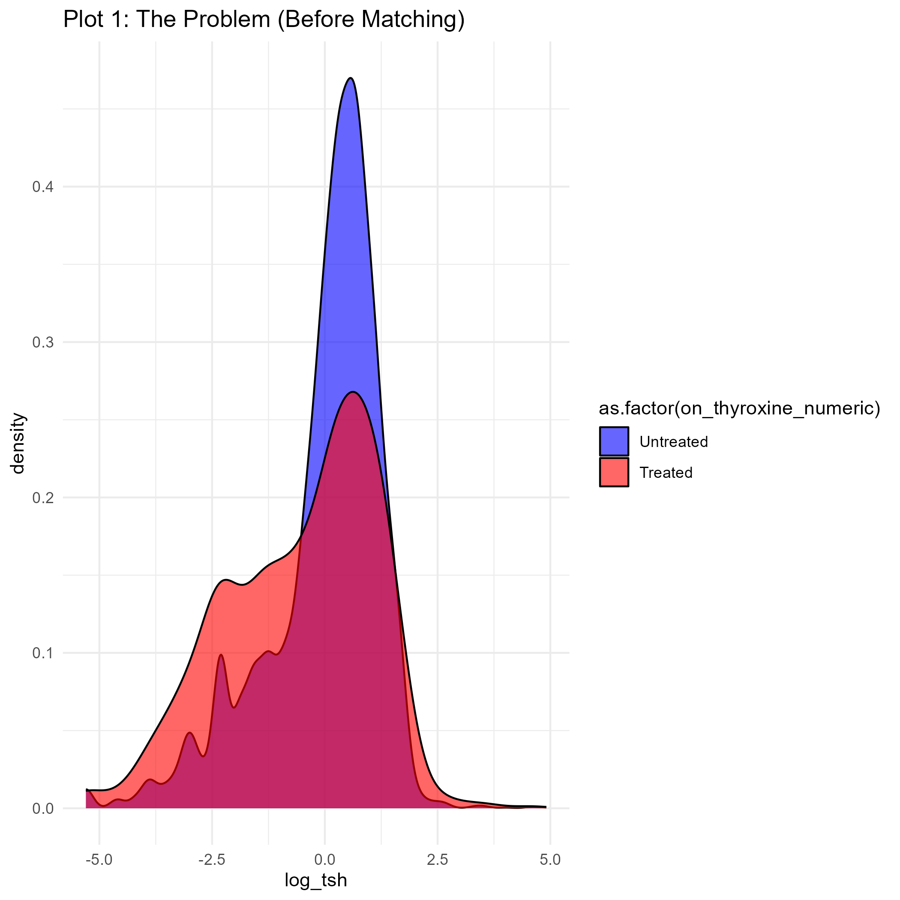
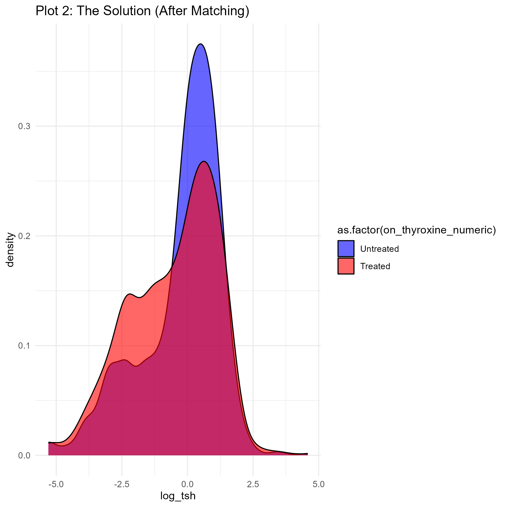
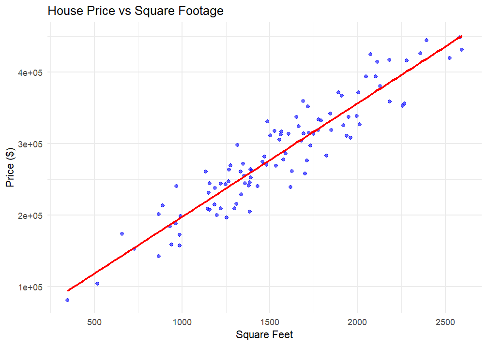

# Data Science & Analytics (R)

This repository documents my academic journey and technical projects in **Data Science, Causal Inference, and Predictive Modeling**. 

It transitions from foundational statistical analysis to advanced techniques like **Propensity Score Matching (PSM)** and **Imputation** applied to healthcare and economic scenarios.

##  Technical Competencies
* **Languages:** R
* **Advanced Libraries:** `MatchIt` (Causal Inference), `mice` (Data Imputation), `tidyverse`, `ggplot2`
* **Statistical Methods:** Linear Regression, Propensity Score Matching, Hypothesis Testing, Synthetic Data Generation.

---

##  Featured Project 1: Causal Inference on Thyroid Treatment
**File:** `Thyroid_Causal_Project/thyroid_analysis.R`

### Context
In real-world medical data, treating patients isn't random—sicker patients often get more medication. This creates "Selection Bias," making it hard to see if a drug actually works. 

In this project, I used **Propensity Score Matching (PSM)** to create a balanced dataset (simulating a randomized trial) to estimate the true causal effect of Thyroxine on T3 levels.

### Key Techniques
* **Missing Data Imputation:** Used MICE (Multivariate Imputation by Chained Equations) to handle gaps in medical records.
* **Causal Matching:** Used the `MatchIt` library to pair treated vs. untreated patients with similar biological traits (Age, Sex, TSH).
* **Visualization:** Plotted distribution density before and after matching to validate the model.

###  Results: The Matching Effect
*Below shows how we corrected the bias. Before matching (left), the groups were totally different. After matching (right), they are comparable, allowing for valid scientific analysis.*

| **Before Matching (Biased)** | **After Matching (Balanced)** |
|:---:|:---:|
|  |  |

---

##  Featured Project 2: Real Estate Price Simulation
**File:** `Mini_Project_Housing_Prediction/housing_price_predictor.R`

To demonstrate mastery of **Linear Regression logic**, I built a simulation engine that generates synthetic housing market data. This project proves that I can understand the underlying mathematical relationships between variables (Size, Age, Price) without relying on pre-cleaned CSVs.

* **Technique:** Synthetic Data Generation & Multivariate Regression.
* **Outcome:** The model successfully identified the engineered correlation between square footage and price, achieving high predictive accuracy on unseen data.

---

##  Academic Modules & Labs
This repository also contains foundational coursework modules covering the standard Data Science pipeline:
* **Data Visualization:** Advanced plotting using `ggplot2` (Facets, Themes, Aesthetics).
* **Statistical Analysis:** Hypothesis testing and probability distributions.
* **Data Preprocessing:** Cleaning pipelines using `dplyr`.

---
###  Contact
**Ashraf Pathan**
